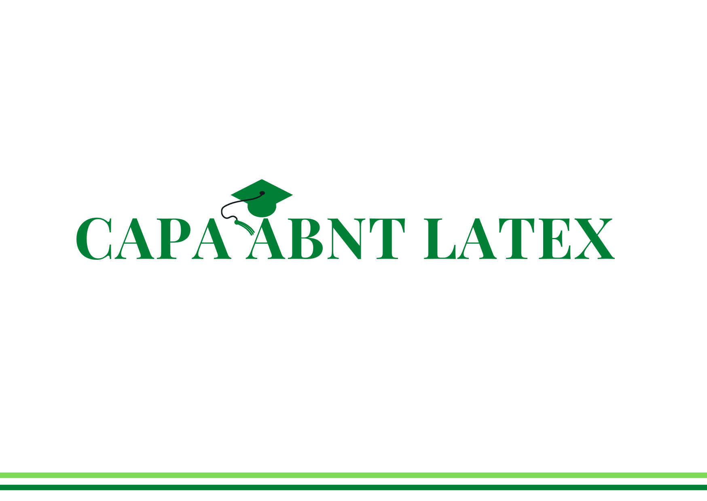
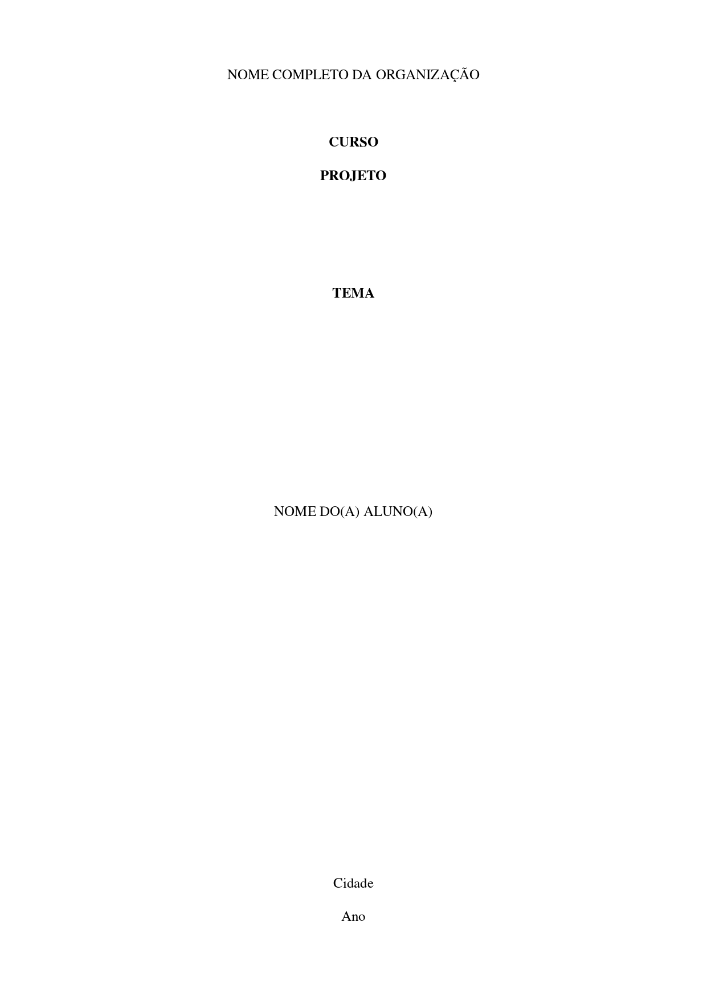
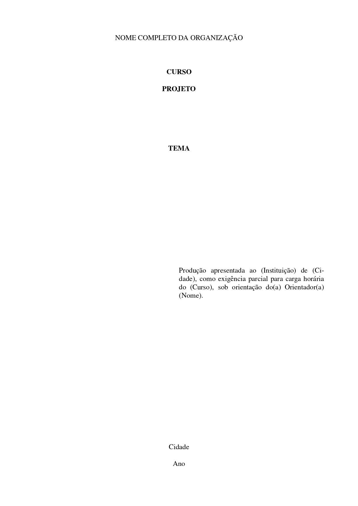
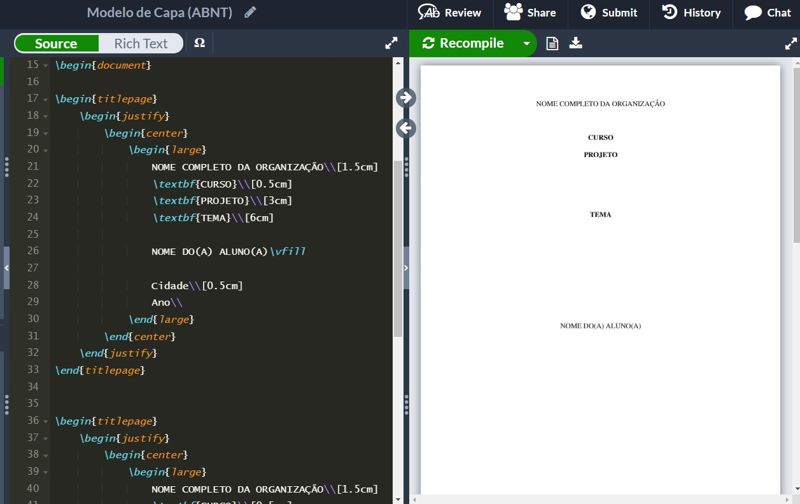

<h3 align="center"> 

</h3>

<h1 align="center">
   📚 <a href="#"> CAPA ABNT LATEX </a>
</h1>

<h3 align="center">
    Modelo nas normas da ABNT feito em LaTex
</h3>


<p align="center">
  
  
  
  
  <a href="https://github.com/vitoriape/capabnt/blob/main/LICENSE.txt">
    
  </a>
  
  <a href="https://github.com/vitoriape/capabnt/commits/main">
    
  </a>
</p>

<h4 align="center"> 
	 Status: Concluído
</h4>

---

[Português (PT-BR)](https://github.com/vitoriape/capabnt/blob/main/LEIAME.md)  | [English (EN)](https://github.com/vitoriape/capabnt/blob/main/README.md)

---
---

Índice
=================
<!--ts-->
   * [Sobre](#sobre)
   * [Ferramentas](#ferramentas)
   * [Referências](#referências)
   * [Recursos](#recursos)
   * [Layout](#layout)
   * [Pré-requisitos](#pré-requisitos)
   * [Instalação](#instalação)
   * [Usando o Overleaf](#usando-o-overleaf)
   * [Autor](#autor)

## Sobre
Este projeto é um modelo em LaTex para criação de folhas de rosto/capas nas normas da ABNT. O arquivo tex gera um PDF compilado. O modelo foi desenvolvido com `Tex Live 2021`. <i>Certifique-se de ter esta versão instalada.</i>

---

## Ferramentas
O desenvolvimento desse modelo utiliza as seguintes ferramentas:

- [Git](https://git-scm.com/)
- [LaTex](https://www.latex-project.org/)
- [Overleaf](https://www.overleaf.com/learn)

## Referências
Para mais informações sobre as normas técnicas brasileiras, consulte o site da [Associação Brasileira de Normas Técnicas](https://www.abnt.org.br/).

## Recursos

- [x] Pacotes
- [x] Classes
- [x] Capa
- [x] Folha de Rosto
- [ ] Modelo dos demais elementos do relatório

## Layout

<table class="tg">
<thead>

  <tr>
    <th class="tg-c3ow">Capa</th>
    <th class="tg-c3ow">Folha de Rosto</th>
  </tr>
</thead>
<tbody>
  <tr>
    <td class="tg-c3ow"><br></td>
    <td class="tg-c3ow"><br></td>
  </tr>
</tbody>
</table>

---

## Pré-requisitos

- Classe do Documento

```tex
\documentclass[a4paper,10pt,titlepage]{article}
```

- Pacotes

```tex
\usepackage[brazilian]{babel}
\usepackage[utf8]{inputenc}
\usepackage{setspace}
\usepackage{ragged2e}
\usepackage{ragged2e}
\usepackage{times}
\usepackage{geometry}
\geometry{
 a4paper,
 total={170mm,257mm},
 left=20mm,
 top=20mm,
 }
```

## Instalação

```bash
# Clone esse repositório
$ git clone <https://github.com/vitoriape/capabnt/>

# Acesse a pasta do projeto
$ cd capabnt

# Importe o arquivo abnt-cover.tex em uma IDE editor de LaTeX, como MiKTeX ou no Overleaf
```

## Usando o Overleaf
Uma maneira fácil de usufruir das ferramentas LaTex é usando o [Overleaf](https://pt.overleaf.com/), um editor colaborativo baseado em nuvem:



Para usar esse modelo de capa no Overleaf, basta seguir as instruções de [instalação](#instalação) e depois fazer o [upload](https://www.overleaf.com/learn/how-to/Uploading_a_project) do arquivo `tex` deste projeto.

---
## Team
### Autor

<table>
  <tr>
    <td align="center"><a href="https://github.com/vitoriape"><br /><sub><b>Vitória Peçanha</b></sub></a><br /><a href="https://www.linkedin.com/in/vitoria-pecanha/" title="LinkedIn">🌐</a>   <a href="mailto:vitoriapecanha.log@gmail.com" title="E-mail">📬</a>   <a href="https://translate.habitica.com/user/PenariaToji/" title="Linguists Commonwealth">📜</a></td>   
</table>


### License

This project is under the   
<a href="https://github.com/vitoriape/capabnt/blob/main/LICENSE.txt">
    
</a>
