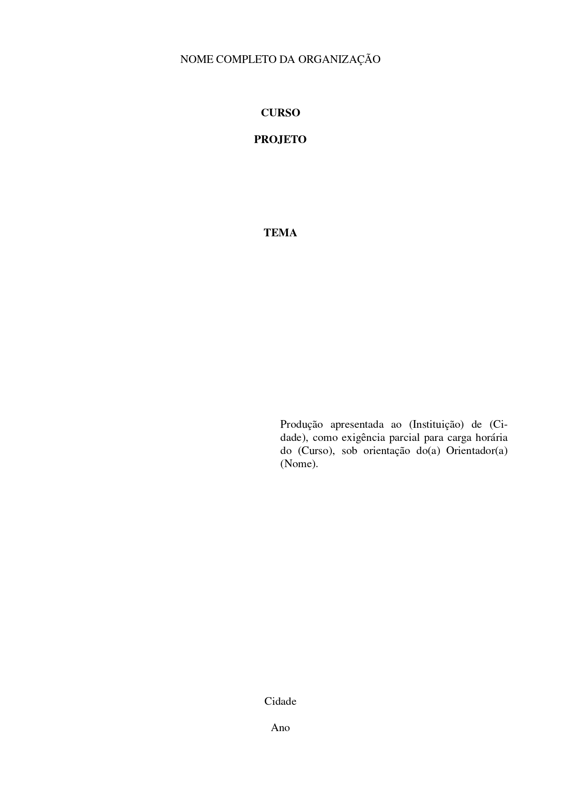

<h3 align="center"> 

</h3>

<h1 align="center">
   📚 <a href="#"> ABNT LATEX COVER </a>
</h1>

<h3 align="center">
    Template in ABNT standards made with LaTex
</h3>


<p align="center">
  
  
  
  
  <a href="https://github.com/vitoriape/capabnt/blob/main/LICENSE">
    
  </a>
  
  <a href="https://github.com/vitoriape/capabnt/commits/main">
    
  </a>
</p>

<h4 align="center"> 
	 Status: Finished
</h4>

---

Index
=================
<!--ts-->
   * [About](#about)
   * [Tools](#tools)
   * [References](#references)
   * [Features](#features)
   * [Layout](#layout)
   * [Pre-requisites](#pre-requisites)
   * [Setup](#setup)
   * [Using Overleaf](#using-overleaf)
   * [Team](#team)

## About
This project is an LaTex template for creates titlepages/covers in ABNT standards. The tex file will provide a compiled PDF. This is a Tex project developed using `Tex Live 2021`.

>[README em Português (pt-br)](https://github.com/vitoriape/capabnt/blob/main/LEIAME.md). 

---

## Tools
Development of this template utilizes the tools listed below:

- [Git](https://git-scm.com/)
- [LaTex](https://www.latex-project.org/)
- [Overleaf](https://www.overleaf.com/learn)

## References
For more information about the brazilian technical standards, check out the website of the [Brazilian Association of Technical Standards](https://www.abnt.org.br/).

## Features

- [x] Usepackages
- [x] Classes
- [x] Cover
- [x] Titlepage
- [ ] Template of the following report elements

## Layout

<table class="tg">
<thead>

  <tr>
    <th class="tg-c3ow">Cover</th>
    <th class="tg-c3ow">Titlepage</th>
  </tr>
</thead>
<tbody>
  <tr>
    <td class="tg-c3ow"><br></td>
    <td class="tg-c3ow"><br></td>
  </tr>
</tbody>
</table>

---

## Pre-requisites

- Document Class

```tex
\documentclass[a4paper,10pt,titlepage]{article}
```

- Packages

```tex
\usepackage[brazilian]{babel}
\usepackage[utf8]{inputenc}
\usepackage{setspace}
\usepackage{ragged2e}
\usepackage{ragged2e}
\usepackage{times}
\usepackage{geometry}
\geometry{
 a4paper,
 total={170mm,257mm},
 left=20mm,
 top=20mm,
 }
```

## Setup

```bash
# Clone this repository
$ git clone <https://github.com/vitoriape/capabnt/>

# Access the project folder
$ cd capabnt

# Upload the file abnt-cover.tex on a LaTeX Editors/IDEs like MiKTeX or Overleaf
```

## Using Overleaf
A easy way to enjoy LaTex tools is using [Overleaf](https://pt.overleaf.com/), an cloud-based collaborative editor:


For use this template on Overleaf just follow the [setup](#instalação) directions, and then [upload](https://www.overleaf.com/learn/how-to/Uploading_a_project) the `tex` file of this project.

---

## Team
### Author

<table>
  <tr>
    <td align="center"><a href="https://github.com/vitoriape"><br /><sub><b>Vitória Peçanha</b></sub></a><br /><a href="https://www.linkedin.com/in/vitoria-pecanha/" title="LinkedIn">🌐</a>   <a href="mailto:vitoriapecanha.log@gmail.com" title="E-mail">📬</a>   <a href="https://translate.habitica.com/user/PenariaToji/" title="Linguists Commonwealth">📜</a></td>   
</table>


### License

This project is under the   


